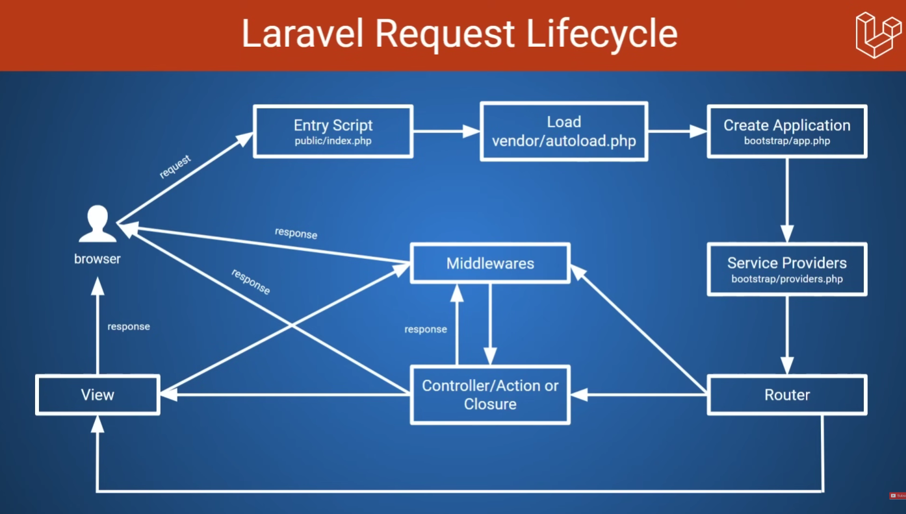

# Laraval Learning

## 0. Introduction

Laraval is developed by `Taylor Otweel` in 2011

**Standout Feature:**

- Built in security
- High Perfomance
- Powerfull Routing
- `ELOQUENT ORM`
- clean and elegeant syntax
- MVC architecture
- Built in support for testing
- Authentication and authorization
- Built in caching support
- Exception and error handling
- Powefull template engine (`Blade`)
- Task scheduling support
- Robust Queue suppory for heavy job
- Multilingual suppory
- Easy to maintain
- Huge community

---

## 1. Setup Working enviroment

**Two way to setup laraval:**

- **Using `laraval herd`** -> <https://herd.laravel.com>

herd is a single program which combine `php`, `nginix`, `node`, `composer`

- **Using `XAMPP`**

**Extension:**

laravel blade, laaravel blade snippet, laraval goto

---

## 2. Getting started with laravel project

- `using composer`

```bash
composer create-project laravel/laravel project-name
```

- `Using laravel installer` -> (internally it still use `composer`)

```bash
composer global require laravel/installer
```

then

```bash
laravel new project-name
```

- `Using laravel herd`

install laravel herd

goto `site`, click on `+` , click `No starter kit`

`using terminal`

```bash
laravel new project-name
```

### 2.1 Introduction to `Artisan`

`artisan` is command line tool, it helps to perfrom you various task to your web application. Such as ->

- Generate code
- Managing Migrations
- Clearing cache

`artisan` is the starting point, where it load the file

- **Give all the info relatd to the project:**

```bash
php artisan about
```

- **show all the command**

```bash
php artisan list
```

- **Group Command:**

```bash
php artisan make help
```

- **Details about specific command:**

```bash
php artisan make:controller --help
```

### 2.2 Project Structure

Laravel follows a philosophy called **"Convention over Configuration."**

```text
root
  |--app
  |   |---- Http -> Controller -> Controller.php
  |   |---- Models -> User.php
  |   |---- Providers -> AppService.php
  |
  |--bootstrap
  |   |---- Cache -> .gitignore, package.php, service.php
  |   |---- app.php (configure middle layer, routing, exception)
  |   |---- providers.php (contain single provider, you can add multiple)
  |
  |--config
  |   |---- app.php
  |   |---- auth.php
  |   |---- cache.php
  |   |---- database.php
  |   |---- filesystems.php
  |   |---- logging.php
  |   |---- mail.php
  |   |---- queue.php
  |   |---- services.php
  |   |---- session.php
  |
  |--database
  |   |---- Factories -> UserFactory.php
  |   |---- migrations
  |   |---- seeders -> DatabaseSeeder.php
  |   |---- .gitignore
  |   |---- database.sqlite
  |
  |--node_modules
  |
  |--public
  |   |---- build
  |   |---- .htaccess
  |   |---- index.php (entry point for all request in your web app)
  |   |---- robots.txt
  |
  |--resources
  |   |---- css
  |   |---- js
  |   |---- views -> welcome.blade.php
  |
  |--routes
  |   |---- console.php
  |   |---- web.php
  |
  |--storage (contain all generated file)
  |   |---- app -> public (uploaded file by the user)
  |   |---- framework (files, folders generated by laravel)
  |   |---- logs (logs file generated by laravel)
  |
  |--tests
  |
  |-- vendor (contains all 3rd party packages)
  |
  |-- .editorconfig is nesscessary for IDE
  |-- .env (contains credentials)
  |-- .env.example (to know which credentials is used)
  |-- .gitattribute
  |-- .gitignore
  |-- artisan
  |-- composer.json
  |-- composer.lock
  |-- package-lock.json
  |-- package.lock
  |-- phpunit.xml (Configuration for running tests.)
  |-- README.md
  |-- vite.config.js
```

#### 1. The Root Level (Project Setup)

_Files that manage dependencies and environment settings._

- **`.editorconfig`**: Configuration for your code editor (VS Code). It ensures consistent indentation (spaces vs. tabs) and line endings across the team.
- **`composer.json`**: The PHP equivalent of `package.json`. It lists all backend dependencies (like the Laravel framework itself).
- **`composer.lock`**: The PHP equivalent of `package-lock.json`. It locks exact version numbers to ensure the app works identically on all machines.
- **`package.json`** & **`package-lock.json`**: Manages frontend dependencies (Tailwind, React, Vue, etc.).
- **`vite.config.js`**: Configuration for **Vite**. Laravel uses Vite to bundle CSS and JavaScript assets, identical to modern React workflows.
- **`phpunit.xml`**: Configuration for running automated tests.
- **`artisan`**: A specific Laravel command-line interface (CLI) script. You run commands like `php artisan make:controller` to generate code.

#### 2. `app/` (The Core Logic)

_Where 90% of your backend logic lives._

- **`Http/Controllers/`**: Contains the logic that handles user requests.
- **`Models/`** (e.g., `User.php`): Represents your database tables. Unlike Prisma's `schema.prisma`, Laravel models are PHP classes that allow you to query data (e.g., `User::all()`).
- **`Providers/`**: Bootstrapping files. Use these to register global services that need to run when the app starts.

#### 3. `routes/` (The Traffic Directors)

_Defines how the application responds to specific URLs._

- **`web.php`**: Handles routes for the web browser. Automatically includes Session state and CSRF protection (security against fake requests). **You will work here most often.**
- **`console.php`**: Defines custom Artisan command-line commands (e.g., a scheduled script to clean up old logs).

#### 4. `resources/` (The Frontend)

_Raw files before they are compiled or sent to the browser._

- **`views/`**: Contains HTML templates using **Blade** (Laravel's templating engine).
- **`css/`** & **`js/`**: Uncompiled assets processed by Vite.

#### 5. `database/` (The Data Layer)

_Database management treated as code._

- **`migrations/`**: Version control for your database schema. Instead of raw SQL, you use PHP code to create tables.
- **`seeders/`**: Files to populate the database with initial data.
- **`factories/`**: Blueprints for generating fake data for testing purposes.
- **`database.sqlite`**: The default file-based database for local development in Laravel 11.

#### 6. `config/` (The Control Panel)

_Global configuration arrays._

- **`database.php`**: Database connection settings.
- **`auth.php`**: User authentication settings.
- _(Note: You rarely edit these directly. Instead, modify the `.env` file, which these config files read from.)_

#### 7. `public/` (The "Open" Door)

_The only folder accessible to the browser._

- **`index.php`**: The entry point for all requests. It loads the framework and passes requests to your routes. **Never edit this.**
- **`favicon.ico`, `robots.txt`**: Standard public web assets.

#### 8. `bootstrap/` (Under the Hood)

- **`app.php`**: Scripts that "boot up" the framework. You rarely touch this.

#### 9. `storage/` (Temporary Files)

- **`logs/`**: Application error logs (e.g., `laravel.log`).
- **`framework/`**: Caches and compiled templates used by Laravel for performance.

#### 10. `tests/` (Quality Assurance)

- **`Feature/`**: Tests that simulate user actions (e.g., "Can a user log in?").
- **`Unit/`**: Tests for specific functions in isolation.

---

### 2.3 Create your first page

serve page on `/about`

`routes/web.php`

```php
Route::get("/about", function () {
    return view("about");
});
```

`resources/views/about/blade.php`

```php
<!DOCTYPE html>
<html lang="en">

<head>
  <meta charset="UTF-8">
  <meta name="viewport" content="width=device-width, initial-scale=1.0">
  <title>Document</title>
</head>

<body>
  <h1>This is welcome page</h1>
</body>

</html>
```

---

### 2.4 Request Life Cycle



---

### 2.5 Configuration

Main configuration exist on `.env`, beyond that exist on `config` folder

all configuration is not avilable on config folder.

**To show all the config folder:**

```bash
php artisan config:publish
```

**To publsih the exact config file:**

```bash
php artisan config:publish cors
```

---

### 2.6 Debugging function

- **`dump()`**

`dump()` is larval built in fn which give all info about the given variable

```php
Route::get("/about", function () {
    $person = ["name" => "afrit", "email" => "afrit@gmail.com"];
    dump($person);
    return view("about");
});
```

- **`dd()`**

`dd()` -> `dump and die` fn print the variable and stop code execution.

```php
Route::get('/', function () {
    $person = ["name" => "afrit", "email" => "afrit@gmail.com"];
    dd($person);
    return view('welcome');
});
```

## 3. Routing

### 3.1 Basic Routing

- **Route that matches multiple route methods**

```php
Route::match(['get', 'post'], "/users", function(){
    // code
});
```

- **Route that matches all request methods**

```php
Route::any( "/", function(){
    // code
});
```

- **Redirect route**

```php
Route::redirect( "/here", "/there", 302);
```

- **Parmanent redirect**

```php
Route::permanentRedirect('/old-path', '/new-path'); // status code 301

// is same as
Route::redirect('/old-path', '/new-path', 301);
```

- **View route**

```php
Route::view("/contact", 'contact');
```

- **pass params for view**

```php
Route::view("/about", 'about', ['phone' => '1234567890']);
```

### 3.2 Route Required Parameters

```php
Route::get("/product/{id}", function ($id) {
    return "Product ID= {$id}";
});
```

```php
Route::get("{lang}/product/{id}/review/{review_id}", function ($lang, $id, $review_id) {
    return "Language = {$lang} <br> Product id = {$id} <br> review id = {$review_id}";
});
```

### 3.3 Route Optional Parameter

`?` represent optional paramas and you have to give default value, otherwise it will give error

```php
Route::get("/product/catagory/{catagory?}", function ($catagory = null) {
    return "Product catagory = {$catagory}";
});
```

### 3.4 Parameter validation

- **`whereNumber("param")`** => param should only be number

```php
Route::get("/product/{id}", function ($id) {
    return "Product ID = {$id}";
}) -> whereNumber("id");
```

- **`whereAlpha("param")`** => param should only be char

```php
Route::get(uri: "/product/catagory/{catagory?}", action: function ($catagory = null): string {
    return "Product catagory = {$catagory}";
}) -> whereAlpha(parameters: "catagory");
```

- **`whereAlphaNumeric(param)`** => param will be alphanumeric

```php
Route::get("/username/{username}", function ($username) {
    return "username = {$username}";
})->whereAlphaNumeric("username");
```

- **multiple sanitization**

```php
Route::get("{lang}/product/{id}", function ($lang, $id) {
    return "{$lang}/product/{$id}";
})->whereAlpha("lang")->whereNumber("id");
```

- **`whereIn("param", ["option1", "option2"])`**

```php
Route::get("{lang}/products", function ($lang) {
    return "{$lang}/products";
})->whereIn("lang", ["en", "bn", "hind"]);
```

### 3.4 Route Parameter Regex

We can also apply custom regex validation logic to our route paramater.

- **`where`**

```php
Route::get("/username/{username}", function ($username) {
    return "username = {$username}";
})->where("username", "[a-z]+"); // param should only be small char
```

- **Using associate array**

```php
Route::get("{lang}/product/{id}", function ($lang, $id) {
    return "{$lang}/product/{$id}";
})->where(["lang" => "[a-z]{2}", "id" => "\d{4}"]);
```

- **`/` will also be consider**

```php
Route::get("/search/{term}", function ($term) {
    return "{$term}";
})->where("term", ".+"); // . is contain any char
```

### 3.5 Named Route

We can define name for each route, but what is a point of naming a route.

#### 1. The Core Problem: "Coupling"

In web development, URLs change often (e.g., changing `/all-products-list` to `/shop`). If you hardcode these URLs in your Views (`<a>` tags) and Controllers (`redirect()`), you create **tight coupling**. A single URL change breaks the entire app, requiring a "Find and Replace" mission across every file.

**Goal:** We want to refer to the _Route_ (the logic), not the _URL_ (the address).

#### 2. **The Two Approaches**

##### Approach A: The "Manual Constant" Method (Your Idea)

You proposed creating a global constants file to manage paths centrally.

**File:** `routeConstant.php`

```php
$productIndex = "/shop";
$productShow  = "/product/";
```

**Usage:**

```php
// Frontend
<a href="<?php echo $productIndex; ?>">Shop Now</a>

// Controller
return redirect($productIndex);

```

**Verdict:** This is a valid logic pattern (Decoupling), but it is "reinventing the wheel" and lacks power.

##### Approach B: Laravel Named Routes (Industry Standard)

Laravel allows you to tag a route with a nickname using `->name()`.

**File:** `routes/web.php`

```php
Route::get('/shop', [ProductController::class, 'index'])->name('products.index');
Route::get('/product/{id}', [ProductController::class, 'show'])->name('products.show');

```

**Usage:**

```html
<a href="{{ route('products.index') }}">Shop Now</a>
```

#### 3. Why Named Routes Win

##### Reason 1: Dynamic Parameters (The "Killer Feature")

The constant method breaks down when you need to pass data (like IDs).

- **Constant Method (Messy):**
  You have to manually concatenate strings. This is prone to typos (missing slashes).

```php
// You must write logic to join strings
<a href="<?php echo $productShow . $user->id; ?>">View</a>

```

- **Named Routes (Clean):**
  Laravel's `route()` function is a **URL Generator**. It knows exactly where to put the ID.

```php
// Laravel handles the placement automatically
<a href="{{ route('products.show', ['id' => $user->id]) }}">View</a>

```

##### Reason 2: Protocol Intelligence (HTTP vs. HTTPS)

- **Constant Method:** Your string is "dumb." It is just text (`/shop`). It doesn't know if your site is secure or not.
- **Named Routes:** The helper is "smart."
- Localhost? It generates `http://localhost/shop`.
- Production? It generates `https://myapp.com/shop`.
- Subdomain? It handles `api.myapp.com/shop`.

##### Reason 3: Readability & Standards

"Code is read more often than it is written."

- **Scenario:** You hire a new Laravel developer.
- If they see `route('products.index')`, they instantly understand it.
- If they see `$productIndex`, they have to stop, search your files to find where that variable is defined, and learn your custom system.

### 3.6 Named Route with parameter

```php
Route::get("{lang}/product/{id}", function ($lang, $id) {
    return "{$lang}/product/{$id}";
}) -> name('product.view');

// now product.view this route have value.
Route::get('/', function () {
    $product = route('product.view', [
        'lang' => 'en',
        'id' => '123'
    ]);
    dd($product);
    return view('welcome');
});
```

**Redirect response:**

```php
Route::get('/user/profile', function () {
    // code
})->name('profile');

Route::get('/current-user', function () {
    return redirect()->route('profile');

    // or
    return to_route('profile');
});
```

### 3.7 Route Groups

Route group which share same prefix

#### - `Route::prefix()`

```php
Route::prefix('/admin')->group(function () {
    Route::get('/users', function () {
        return '/admin/users';
    });
    Route::get('/dashboard', function () {
        return '/admin/dashboard';
    });
});
```

#### `Route::name()`

```php
Route::name('.admin')->group(function () {
    Route::get('/users', function () {
        return '/users';
    })->name('users'); // name => 'admin.users'
});
```

_Use case:_

```php
// before
Route::prefix("/admin")->group(function(){
    // You have to type 'admin.' every time
    Route::get("/users", function(){...})->name('admin.users');
    Route::get("/settings", function(){...})->name('admin.settings');
    Route::get("/dashboard", function(){...})->name('admin.dashboard');
});

//after
Route::prefix("/admin")->name('admin.')->group(function(){

    // Laravel automatically names this: 'admin.users'
    Route::get("/users", function(){
        return "User List";
    })->name('users');

    Route::get("/settings", function(){
        return "Settings";
    })->name('settings');
});
```

### 3.8 Fallback Routes

```php
Route::fallback(function () {
    return "This is fallback route";
});
```

### 3.9 View Register Route with Artisan

#### Give all the route list

```bash
php artisan route:list
```

#### Show middleware for each route

```bash
php artisan route:list -v
```

#### Give all the route define by only dev

```bash
php artisan route:list --except-vendor
```

#### Give route only define by laravel

```bash
php artisan route:list --only-vendor
```

#### Give route which have certion keyword

```bash
php artisan route:list --path=keyword
```

**We can also combine command:**

```bash
php artisan route:list -v --except-vendor --path=admin
```

### 3.10 Route Caching

Once you deploy your laravel project in production it is recommended to execute the following command.

```bash
php artisan route:cache
```

This will create cached version of Laravel route. This is helpful when project have lot of route, cache will help your application to match the route in a shorter time.

**To disable cache:**

```bash
php artisan route:clear
```

---

---

## 4 Controllers

### 4.1 Basic of Controllers

Controller is a class which is associate to one or more routes and it's responsible for handling request of that routes. Generally, controller is a grouping of similar route together. For example product controller should only contain logic related to product but not anything else.

**Make controller file by command:**

```bash
php artisan make:controller HomeController
```

File should have `Controller` word at last

`CarController.php`

```php
class CarController extends Controller
{
    public function index()
    {
        return "This is car controller";
    }
}
```

`web.php`

```php
Route::get('/car', [CarController::class, 'index']);
```

---

### 4.2 Group Routes by Controller

If we have multiple function from same class, instead of reapting the same class, we can group them

```php
// before
Route::get('/car', [CarController::class, 'index']);
Route::get('/buy-car', [CarController::class, 'buy']);
Route::get('/sell-car', [CarController::class, 'sell']);

//after
Route::controller(CarController::class)->group(function () {
    Route::get('/car', 'index');
    Route::get('/buy-car', 'buy');
    Route::get('/sell-car', 'sell');
});
```

---

### 4.3 Single Action Controller

If your application grows and became very large it is recommended to split it up into multiple other controller, or create single action controller. Single action controllers are controllers that are associated to a single route only.

Create single action controller by command

```bash
php artisan make:controller [Filename] --invokable
```

```php
Route::get('/car', CarController::class);
```

---

### 4.4 Resource Controllers

In Laravel the 'Resource controller' is a special type of controller that provides a convenient way to handle typical CRUD operations for a resource such as database table.

```bash
php artisan make:controller [filename] --resource
```

In resource controller there are 7 predefine methods.

- `index()`: Display a listing of the resource.
- `create()`: Show the form for creating a new resource.
- `store()`: Store a newly created resource in storage.
- `show()`: Display the specified resource.
- `edit()`: Show the form for editing the specified resource.
- `update()`: Update the specified resource in storage.
- `destroy()`: Remove the specified resource from storage.

`create()` and `edit()` are not related to api.

We can create route seperately for the each methods but there is oneliner which can do this thing.

```php
Route::resource(name: '/product', controller: ProductController::class);
```

To know which route will do what -

```bash
php artisan route:list --path=product
```

Exclude certain methods

```php
Route::resource(name: '/products', controller: ProductController::class)->except(methods: ['destroy']);
```

Include certain methods

```php
Route::resource(name: '/products', controller: ProductController::class)->only(methods: ['index', 'show']);
```

5 out of them are relevant to api, so you want only those methods will stay do this -

```php
Route::apiResource(name: '/products', controller: ProductController::class);
```

Or, when you creating controller only for api do this -

```bash
php artisan make:controller [filename] --api
```

If you want to create multiple resource controller

```php
Route::apiResources(resources: [
    '/car' => CarController::class,
    '/products' => ProductController::class
]);
```

---

### 4.5 Create Home Controller

```php
Route::get('/', [HomeController::class, 'index']);

// HomeController.php
public function index(){
    return "Index"
}
```

---

### 4.6 Create and Render Views

Views are files that are responsible for presentation logic in your Laravel applications and are stored under `resource/views` folder. Typically views are in form of blade file.

**`Blade:`** Blade is Laravel's template engine that helps you to build HTML views efficiently. It allows mixing HTML with PHP using simple and clean syntax.

**Blade Core Feature:**

- `Template Inheritance:` Blade template inheritance enabling you to define a base layout and extend it to other views.

- `Directives:` It provides directive with different purpose for control flow.

- `Components & Slots:` Blade also support reusable component and slots.

All blade views must have extension => `*.blade.php`

Create blade file `index.blade.php` =>

```bash
php artisan make:view index
```

```php
Route::get('/', [HomeController::class, 'index']);

// HomeController.php
public function index(){
    return  view('index');
}
```

create file > `/views/home/index.blade.php`

```bash
php artisan make:view home.index
```

```php
Route::get('/', [HomeController::class, 'index']);

// HomeController.php
public function index(){
    return view('home.index');
}
```

---

### 4.7 - Render View using View Facade

To render view there is 2nd method `View`, comming from `Illuminate\Support\Facades\View`.

How to use `View`

```php
use Illuminate\Support\Facades\View;

class HomeController extends Controller
{
    public function index(){
        return View::make('home.index');
    }
}
```

- **`first()` method:** `first()` method will render the first available view.

```php
public function index(){
    return View::first(['index', 'home.index']);
}
```

- **`exist()` method:** This method used to verify the existence of a view file before rendering it.

```php
public function index(){
    if(View::exists('home.index')){
        dump("View does't exist");
    }
    return View::first(['index', 'home.index']);
}
```

When to use which view

- `view('welcome')` is a global "Helper" function. [link](https://dev.to/frankliniwobi/mastering-global-functions-in-laravel-easy-methods-for-versions-891011-4e02)

- `View::make('welcome')` is a "Facade". [text](<https://laravel.com/docs/12.x/views#:~:text=Views%20may%20also%20be%20returned,'%20%3D%3E%20'James'%5D)%3B>)

**1. Clarity in "Non-Standard" Locations**
Using the global helper `view()` inside a Controller is fine. But if you are writing code in a Service Provider or a utility class, using global functions can look "messy" or magical.

Using the Facade `View::` makes it explicit that your class relies on the View Factory. It allows you to import the class at the top of the file, which follows strict Object-Oriented Programming (OOP) standards.

```php
// In a ServiceProvider, this looks more professional and explicit:
use Illuminate\Support\Facades\View;

public function boot()
{
    // "I am configuring the View system"
    View::share('site_name', 'My Awesome App');
}
```

**2. Static Methods (The Real Advantage)**
The Facade provides cleaner access to utility methods that don't involve simply "loading" a page.

When you want to attach logic to a view every time it renders (like always attaching the user's avatar to the Navbar), you must use the Facade.

```php
// You cannot do this easily with the helper
View::composer('partials.navbar', function ($view) {
    $view->with('avatar', Auth::user()->avatar);
});
```

| Scenario                     | Recommendation         | Why?                                                                                                            |
| :--------------------------- | :--------------------- | :-------------------------------------------------------------------------------------------------------------- |
| **Returning a page**         | `return view('home');` | It's shorter, cleaner, and the standard convention for Controllers.                                             |
| **Sharing global variables** | `View::share(...)`     | It clearly indicates a configuration setting (often used in `AppServiceProvider`).                              |
| **Checking existence**       | `View::exists(...)`    | improved readability over `view()->exists(...)`.                                                                |
| **Service Providers**        | `View::composer(...)`  | Strict typing and imports (`use Illuminate\Support\Facades\View;`) look more professional in class-based files. |

---

### 4.8 Pass Data to Views

There is two ways to pass variable to view

- using `associative array`

```php
public function index()
{
    return view('home.index', ['name' => 'Afrit', 'surname' => 'Bagani']);
}

// home/index.blade.php
<h1>My name is {{ $name }} {{ $surname }}</h1>
```

- using `with()` method:

```php
public function index()
{
    return view('home.index')->with('name', 'Afrit')->with('surname', 'Bagani');
}
```
